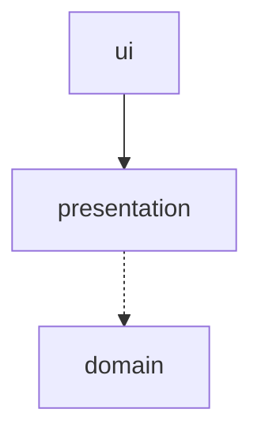
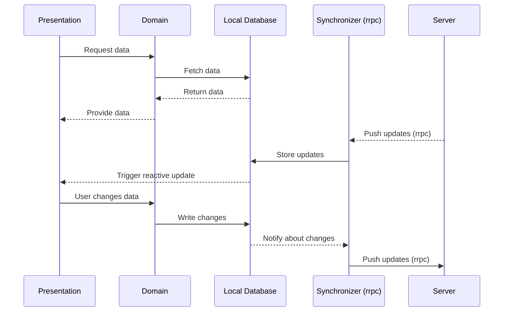
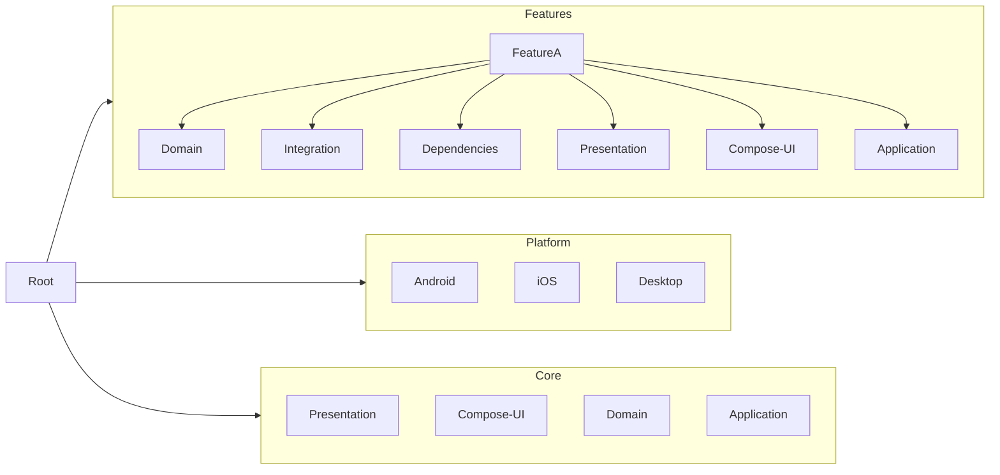

# Architecture

## Core Design Principles

Both client and server follow **Hexagonal Architecture** and **Domain-Driven Design**, ensuring that business logic is
isolated from technical concerns. Each module has a well-defined structure, with layers depending only inwards.

You can refer to this detailed article describing the design philosophy:  
[Digging deep to find the right balance between DDD, Clean, and Hexagonal Architectures](https://dev.to/y9vad9/digging-deep-to-find-the-right-balance-between-ddd-clean-and-hexagonal-architectures-4dnn)

### Domain Model and Validation

The **domain layer** is the heart of each feature. It defines business rules and value objects, without depending on any
external technology or library (except `kotlinx.coroutines` and `kotlinx.datetime`). No framework-specific or
serialization libraries (like `kotlinx.serialization`) are allowed.

All value objects are validated using [`kotlidator`](https://github.com/y9vad9/ktiny-libs), ensuring the domain model is
fully protected against invalid state. Only primitive booleans are allowed at the domain level—no raw `String`, `Int`,
or other primitives may exist unwrapped.

The domain layer exposes interfaces (ports) that are implemented in the integration layer, enabling inversion of
dependencies and facilitating testability.

### Entity Duplication and Mapping Strategy

Entities exist on several levels and are mapped explicitly between those layers to ensure isolation:

- **SDK Level**: Provides stable, hand-written models for external API usage—even if `rrpc` autogenerates some code,
  these models are curated and versioned deliberately.
- **Domain Level**: Domain entities are mapped from SDK types at the integration boundary of each feature.
- **Presentation Layer**: Presentation modules define their own types that are tailored for UI state management.
- **Integration Layer**: Acts as the bridge between the domain and external systems (e.g., local database, SDK, or file
  system).
    - When interacting with persistence, it uses **SQLDelight-generated types** for storage.
    - Mappings between database types and domain entities are handled internally within the integration layer—usually
      automatically, but explicitly when needed.
    - This layer is also responsible for adapting SDK-level models into domain models and vice versa.
    - It's the only layer allowed to communicate with external APIs (like other features, for example) or persistence
      mechanisms.

### UI Module Architecture

Each feature that includes a UI consists of two modules:

- **`:presentation`**:
    - Implements MVI logic using [`flowmvi`](https://github.com/respawn-app/FlowMVI).
    - Has no transitive dependencies and can be used standalone by the `:ui` module.
    - Defines its own types specific to presentation logic, without strict validity requirements (unlike domain).
    - Depends on the domain and potentially other domains.
- **`:compose-ui`**:
    - Contains the Compose UI layer.
    - Depends only on the `:presentation` module within its feature.

The relation between modules within a feature is:



No circular or direct UI-to-domain dependencies are allowed. The `:presentation` module acts as the orchestrator between
the UI and domain.

## Synchronization and Data Flow

TimeMate is designed as a **local-first application**. The client stores all task-related data locally using SQLDelight.
The only exceptions are attachments like videos or images, which are loaded lazily.

### Source of Truth

The **integration layer of the domain** interacts only with the local database to fetch data. Incoming updates from the
server are not fetched directly into the UI. Instead:

- Updates are **received asynchronously** through `rrpc` and stored in the database.
- The UI is **reactively bound** to the local database and responds to changes.
- This eliminates the need to poll the server and creates a robust caching and synchronization model.

The flow is the following:



> **Note:**  
> Each change is timestamped with both `local_time` (UTC time on the client) and `server_received_time`. When the client
> pushes an update, the server compares the `local_time` of the incoming change with the one stored for the same entity.
> If the remote version's `local_time` is **newer**, the update is **rejected**, and the server **notifies the client** to
**overwrite local changes** with the latest version from the server. This ensures **conflict resolution** based on most
> recent edits, preserving a consistent and predictable state across devices.

### Real-Time Capabilities

Shared timers and task updates are managed using **RSocket rrpc**, enabling live collaboration where needed. All other
features work fully offline by default.

### Hosting Options

The backend can be **self-hosted** by the user, giving full control over deployment, data, and integration. This fits
the philosophy of TimeMate as a privacy-conscious and extensible task management tool.

## Application Layer

The **application layer** serves as the central point of coordination, connecting all the layers of the code, including
platform-specific functionality, business logic, and external dependencies. Since TimeMate is a **Kotlin Multiplatform**
project, the application layer is designed to run seamlessly across multiple platforms: **Android**, **iOS**, and *
*Desktop**. The structure of this layer ensures that platform-specific code is minimal and that the core logic remains
shared across all platforms.

### Platform-Specific Implementations

Each platform — Android, iOS, and Desktop — has its own implementation that adapts the shared business logic and
integrates with platform-specific features, such as UI components, file systems, and native APIs. The shared codebase in
Kotlin Multiplatform ensures consistency, while platform-specific code handles the unique aspects of each environment.

#### Platform Modules

- **`:platform:android`**:  
  Contains Android-specific code, including the use of Android's native UI framework (Jetpack Compose for Android) and
  platform-specific services (e.g., notifications, background tasks). The application layer on Android coordinates the
  UI, domain logic, and integration with the local database.
- **`:platform:ios`**:  
  Integrates with the iOS ecosystem, using Swift/Objective-C for platform-specific implementations. The shared logic is
  exposed to the iOS layer using Kotlin/Native, and the UI is built with SwiftUI or UIKit. The application layer on iOS
  handles iOS-specific UI elements, file storage, and integration with iOS features like notifications.
- **`:platform:desktop`**:  
  Targets desktop environments (Windows, macOS, Linux), with the UI built using Compose for Desktop. The application
  layer on Desktop interacts with native file systems and platform-specific window management, but otherwise shares most
  of the business logic with other platforms.

### Shared Core Logic

The **shared code**—located in the common module—encapsulates the business logic and platform-independent components.
This code is used by all platforms and includes:

- **Domain Models**: Represents tasks, timers, and other core business entities.
- **Use Cases**: The core application logic that drives the flow of data and operations within the app.
- **UI State**: Defines the structure for managing UI state in a platform-agnostic way (through MVI architecture).
- **Networking and Synchronization**: The client-server communication, including both REST API and `rrpc` for
  synchronization and sharing task updates or timers in real-time.

The shared core code ensures consistency across platforms, while platform-specific implementations deal with UI
rendering, local file storage, notifications, and other platform-specific services.

### Platform-Specific Code Accessing Shared Logic

While the application logic itself is shared across platforms, each platform has specific implementation details that
are abstracted away from the shared code. These implementations ensure that the platform-specific user experience is
maintained while still leveraging the shared business logic.

For example, in the **Android** platform, the Android UI layer interacts with the shared use cases to fetch tasks or
handle timer updates. Similarly, the **iOS** platform will use the same shared logic to display tasks, manage the task
state, and synchronize data, but it will leverage iOS-specific UI components like SwiftUI or UIKit.

The **Desktop** version utilizes Compose for Desktop for building the UI and integrates the same shared core logic,
making it consistent with the Android and iOS versions, but adapting it to the desktop environment.

### Handling Platform-Specific Features

In addition to using shared code, the application layer provides hooks to access platform-specific features. These
include:

- **File System Access**: Each platform has its own file system API that interacts with the local database and task
  attachments. The shared code abstracts these file system operations, but platform-specific implementations provide the
  necessary interface for storage.
- **Notifications**: Each platform has its notification system (e.g., Android Notifications, iOS Push Notifications,
  Desktop system tray alerts). The application layer in each platform handles local notifications, but the business
  logic for creating and managing notifications is shared.
- **Background services**: Each platform has its own system for background services. We need it for syncing.

### Dependency Injection and Platform Integration

The application layer leverages **Koin** for Dependency Injection (DI) across platforms. Dependencies, such as
repositories, use cases, and network clients, are injected into platform-specific components as needed. Koin ensures
that platform-specific code does not directly depend on platform-specific implementations but rather on abstractions
that are implemented in the shared module.

### Expected Project Structure

The project is structured to promote modularity, reusability, and maintainability while separating concerns across
different features, platforms, and shared core modules. The following explains the key sections of the expected project
structure and their purpose. The structure is designed to scale across multiple platforms (Android, iOS, Desktop) and
support independent feature development.

### Features

Each feature follows a clean separation of concerns, with distinct layers for the domain, integration, presentation, and
UI. Dependencies for each feature are injected using Koin to manage and isolate each feature's dependencies.

```
:features
  :featureA
    :domain
    :integration
    :dependencies (Koin)
    :presentation
    :compose-ui
    :application
```

- **Domain**: Contains domain models, use cases, and core business logic that is independent of any platform-specific
  code.
- **Integration**: Responsible for interfacing with external systems, such as networking (REST, `rrpc`), databases, and
  file storage.
- **Dependencies (Koin)**: Defines dependencies for the feature, injected into relevant parts of the application.
- **Presentation**: Implements the MVI architecture and manages the UI state for the feature.
- **Compose-UI**: Contains platform-agnostic Compose UI components specific to the feature.
- **Application**: Contains application-layer logic such as UseCases and repositories. While some put this kind of code
  inside the domain, we keep it separate because it mainly handles application-specific workflows and data access, which
  we consider not to be core domain concerns.

### Platform

The platform directory contains platform-specific code that adapts the shared logic and business rules to each
environment. Platform modules handle UI rendering and native APIs.

```
:platform
  :android
  :ios
  :desktop
```

- **Android**: Contains Android-specific UI and platform services, such as notifications and background tasks.
- **iOS**: Contains iOS-specific UI components, native integrations, and platform features.
- **Desktop**: Handles desktop-specific UI and integrations for Windows, macOS, and Linux using Compose for Desktop.

### Core

The core section contains shared modules that are used across all features and platforms. These modules are agnostic to
any specific feature or platform and provide common functionality, such as shared UI components, utilities, domain
types, and localization.

```
:core
  :presentation
  :compose-ui
  :domain
  :localization
```

- **Presentation**: Contains shared utilities for managing UI state and validation, like input validation components (
  e.g., [Input in todo-list-app](https://github.com/y9vad9/todo-list-app/blob/master/presentation/src/commonMain/kotlin/com/y9vad9/todolist/presentation/validation/Input.kt)).
- **Compose-UI**: Shared UI components that can be reused across multiple features, ensuring consistency and reducing
  duplication.
- **Domain**: Shared domain types that are reused across multiple features (e.g., value types for tasks, timers). Only
  the most common domain types are shared; feature-specific types remain isolated within their respective domains.
- **Localization**: Manages translation resources and localization utilities for supporting multiple languages across
  all platforms.

### Project Structure (Gradle Hierarchy)

```
:root
  :features
	:core
	  :presentation
	  :compose-ui
	  :domain
	  :localization
	:featureA
      :domain
      :application    <-- Use Cases & Repositories here
      :integration
      :presentation
      :compose-ui
  :platform
    :android
    :ios
    :desktop
  :foundation <-- folder containing submodules that are considered as "libraries"
     :validation-ext
```

### Mermaid Diagram



This structure ensures that the application is both modular and flexible, allowing new features to be added with minimal
disruption to the existing codebase. It also promotes reuse and keeps platform-specific logic separate from shared
business and UI components.
