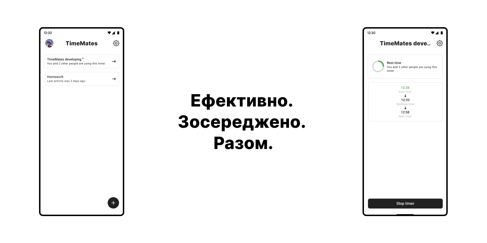

# 
TimeMates

TimeMates - це мультиплатформенний застосунок, побудований з використанням Kotlin, Compose,
Coroutines та gRPC. Він призначений для покращення продуктивності команд, надаючи гнучкі таймери,
нотатки та безпроблемну інтеграцію з іншими платформами, наприклад, GitHub у майбутньому.

Незалежно від того, чи ви працюєте над командним проектом, чи просто виконуєте власні домашні завдання, TimeMates має все необхідне,
щоб ви були організовані, зосереджені та продуктивні. Додаток дозволяє користувачам створювати персоналізовані таймери для своїх завдань,
щоб вони могли залишатися в ритмі та виконувати терміни.

## 
Наш прогрес

Якщо ви хочете дізнатися, як ми працюємо з TimeMates, ви можете переглянути [нашу дошку](https://github.com/orgs/timemates/projects/3/views/2).
