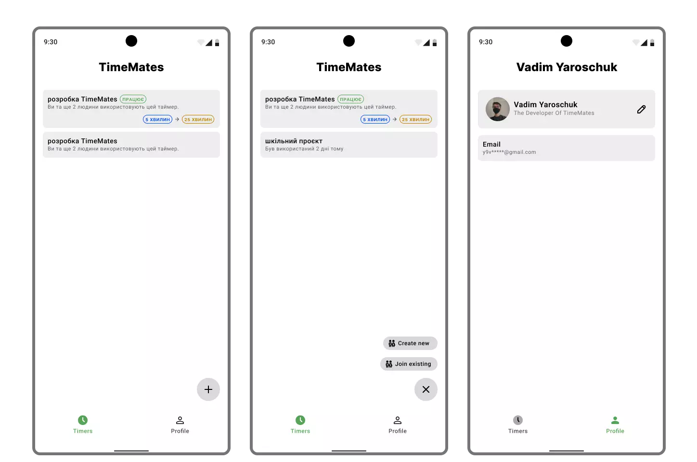
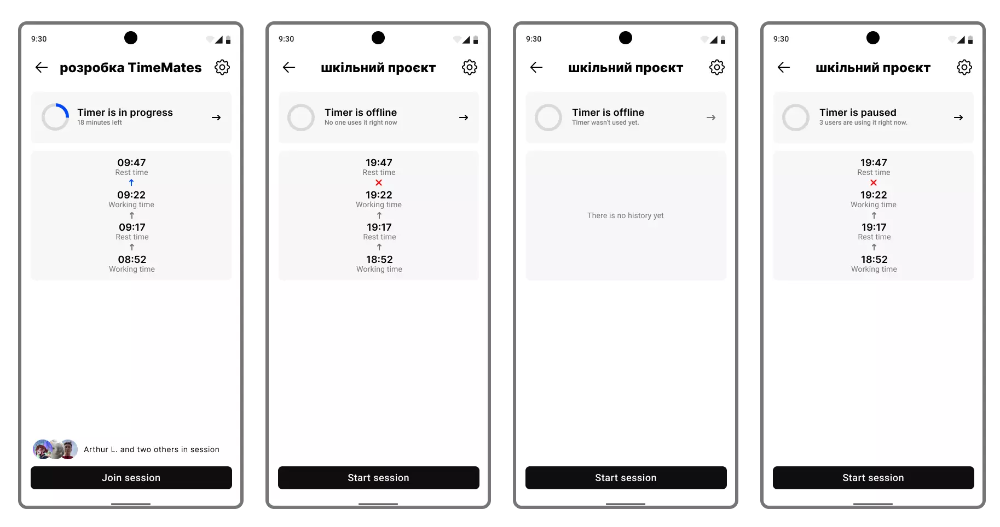

  
  <h1 align="center">TimeMates Multiplatform App</h1>

TimeMates is a multiplatform application that was built with Kotlin, Compose,
Coroutines and gRPC. It is designed to help teams enhance their productivity by providing customizable timers,
notes and seamless integrations with other platforms like GitHub in the future.

Whether you are working on a team project or just tackling your own homework, TimeMates has everything you need to
stay organized, focused, and productive. The app allows users to create personalized timers for their tasks,
so they can stay on track and meet deadlines.

  
  

## Our progress
If you want to know how we're dealing with TimeMates, you can check [our
board](https://github.com/orgs/timemates/projects/3/views/2).